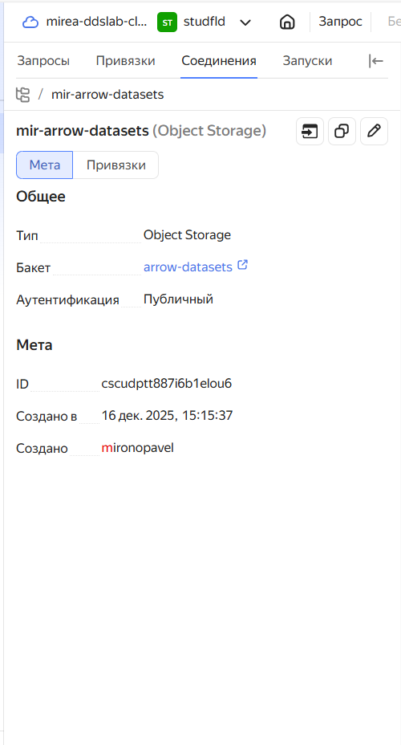
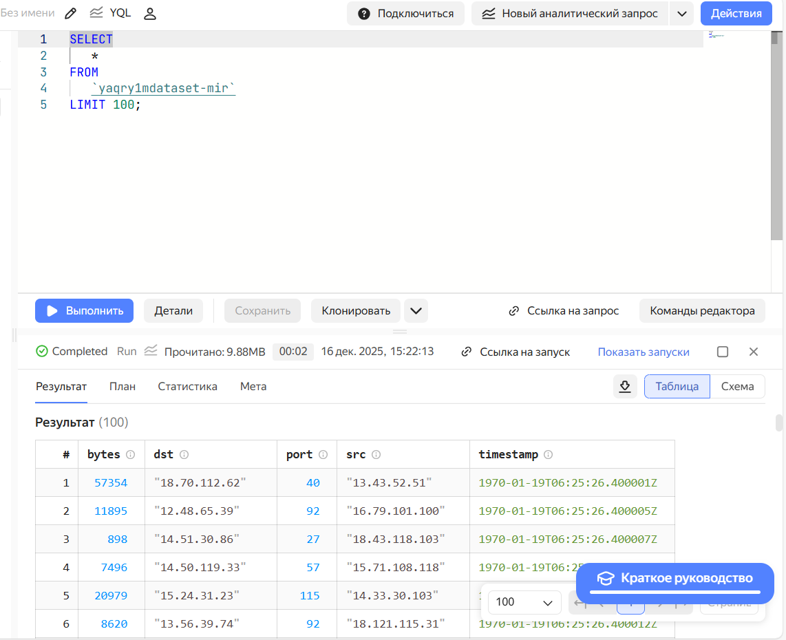
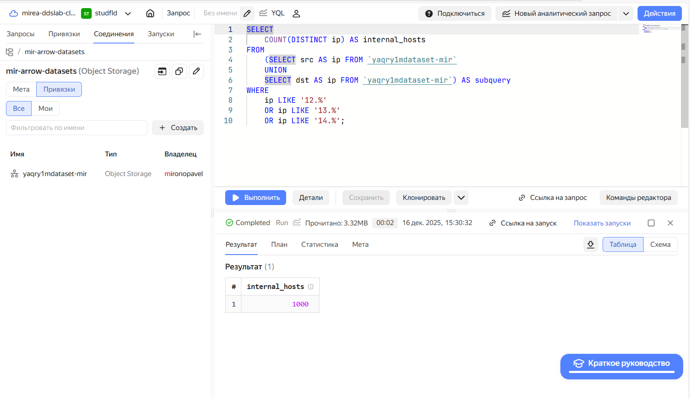
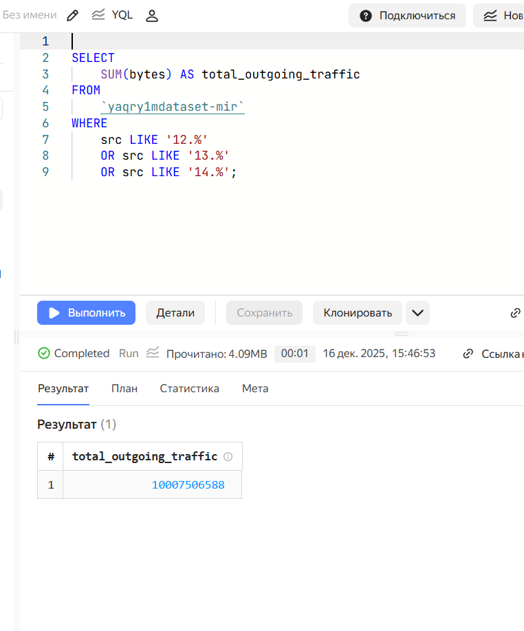
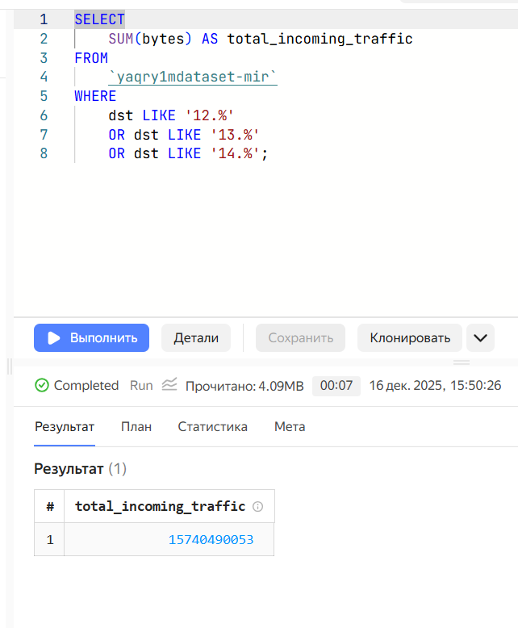

## Цель работы

1. Изучить возможности технологии 
  Yandex Query для анализа структурированных
  наборов данных
2. Получить навыки построения аналитического пайплайна для анализа данных с
  помощью сервисов Yandex Cloud
3. Закрепить практические навыки использования SQL для анализа данных сетевой
активности в сегментированной корпоративной сети

## Исходные данные

1. Программное обеспечение Windows 10 Pro
2. Rstudio Desktop
3. Интерпретатор языка R 4.5.1
4. Yandex Query

## План

1. Подключение датасета
2. Создание привязки
3. Тренировка

## Шаги

1 Создание соединения

 
 
2 Тестовый запрос

  
  
3  Известно, что IP адреса внутренней сети начинаются с октетов, принадлежащих
интервалу [12-14]. Определите количество хостов внутренней сети,
представленных в датасете.

  
  
4  Определите суммарный объем исходящего трафика

  
  
5 Определите суммарный объем входящего трафика

  
  
## Оценка результата

 В результате выполнения мы разабрались с базовыми запросами yandexquery

## Вывод

Таким образом, мы научились взаимодействовать с жкосистемой Yandex Cloud и их продуктами Yandex Query