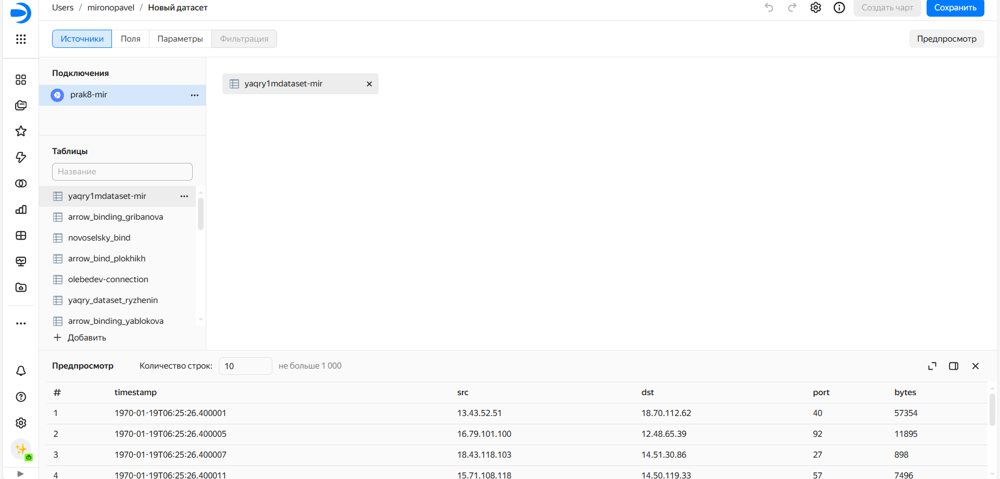
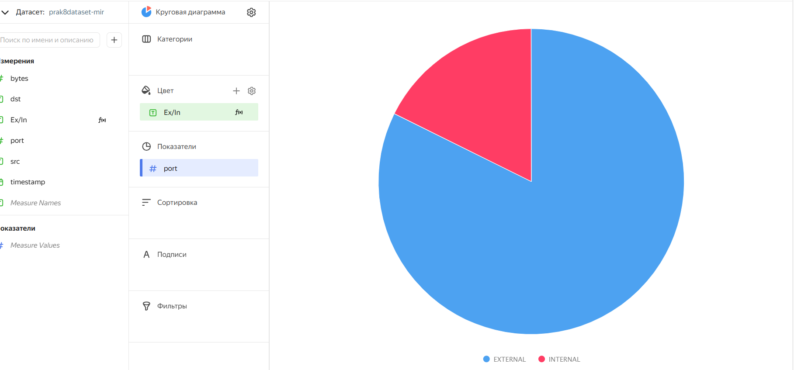
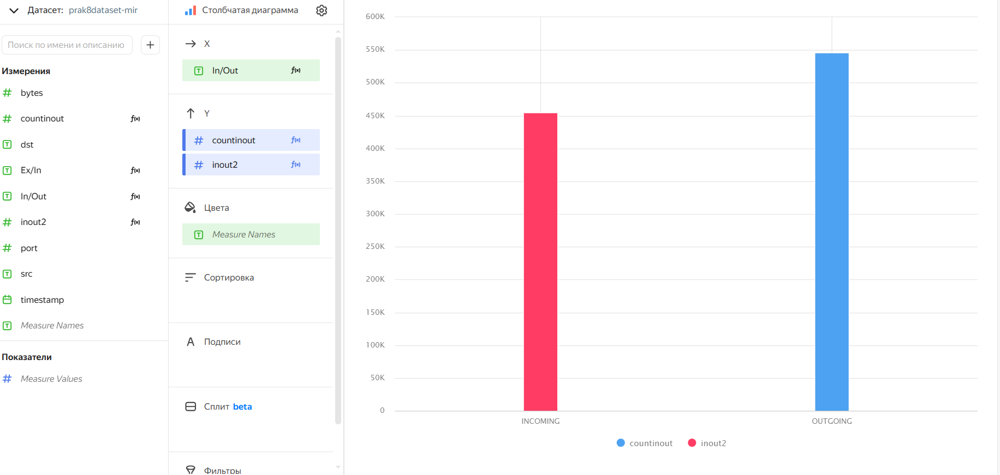
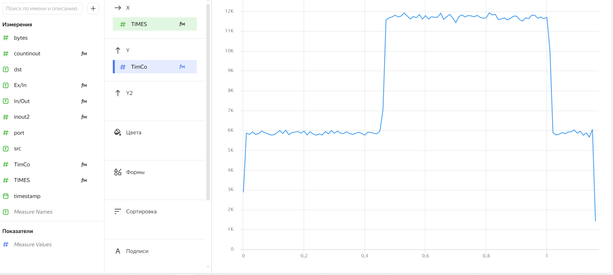
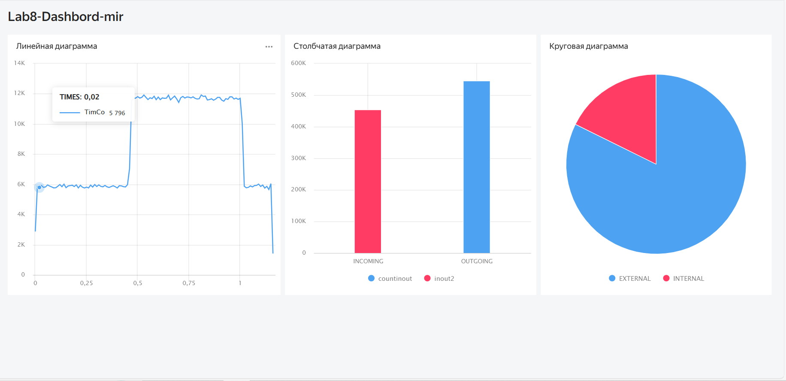

## Цель работы

1. Изучить возможности технологии 
  Yandex Query для анализа структурированных
  наборов данных
2. Получить навыки построения аналитического пайплайна для анализа данных с
  помощью сервисов Yandex Cloud
3. Закрепить практические навыки использования SQL для анализа данных сетевой
активности в сегментированной корпоративной сети

## Исходные данные

1. Программное обеспечение Windows 10 Pro
2. Rstudio Desktop
3. Интерпретатор языка R 4.5.1
4. Yandex Query

## План

1  Настроить подключение к Yandex Query из DataLens
2 Представить в виде круговой диаграммы соотношение внешнего и внутреннего
сетевого трафика.
3 Представить в виде столбчатой диаграммы соотношение входящего и
исходящего трафика из внутреннего сетвого сегмента.
4 Построить график активности (линейная диаграмма) объема трафика во
времени.
5 Все построенные графики вывести в виде единого дашборда в Yandex DataLens

## Шаги

1 Создание датасета

  
  
2  Представить в виде круговой диаграммы соотношение внешнего и внутреннего
сетевого трафика

  
  
3  Представить в виде столбчатой диаграммы соотношение входящего и
исходящего трафика из внутреннего сетвого сегмента

  
  
4  Построить график активности (линейная диаграмма) объема трафика во
времени.

  
  
5 Все построенные графики вывести в виде единого дашборда в Yandex DataLens.

  
  
## Оценка результата

 В результате выполнения мы разабрались с построением диаграм, используя Yandex Datalens

## Вывод

Таким образом, мы научились взаимодействовать с экосистемой Yandex Cloud и их продуктами Yandex Datalens